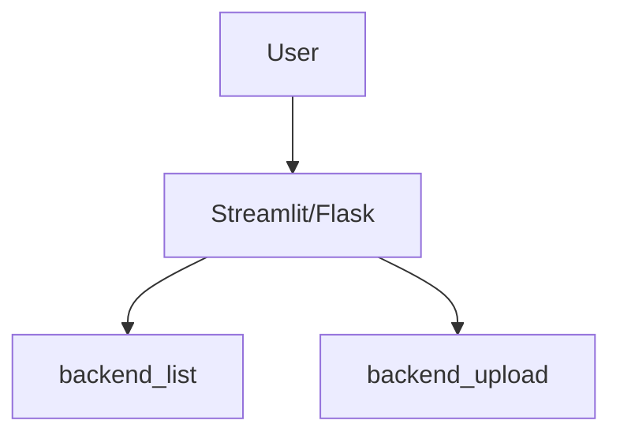

# Multi-App Azure Storage Manager

This project is a multi-service application designed to demonstrate interacting with Azure Blob Storage through separate backend and frontend services. It showcases a microservices-style architecture where different components handle specific tasks like listing files and uploading files.

## Architecture Overview

The application is composed of four main services:

1.  **`backend_list/`**: A FastAPI service that provides an endpoint to list all blobs within a specified Azure Blob Storage container.
2.  **`backend_upload/`**: A FastAPI service that provides an endpoint to upload files directly to a specified Azure Blob Storage container.
3.  **`frontend/`**: A Streamlit-based single-page application (SPA) that provides a user-friendly interface to both list files and upload new ones via the backend services.
4.  **`frontend2/`**: A Flask-based web application that serves as an alternative frontend, using Jinja2 templates to interact with the backend services.

## Key Technologies

*   **Backend**: Python, FastAPI, Azure Storage Blob SDK
*   **Frontend**: Streamlit (for the SPA), Flask & Jinja2 (for the web app)
*   **Infrastructure**: Docker (for containerization), Azure Blob Storage

## How It Works

The application uses environment variables to configure the connection string and container name for Azure Blob Storage. The frontend services communicate with the backend services via HTTP requests, demonstrating how different parts of a distributed system can interact.
